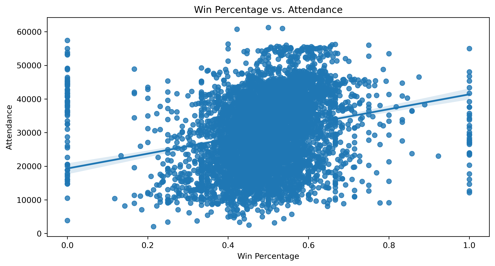
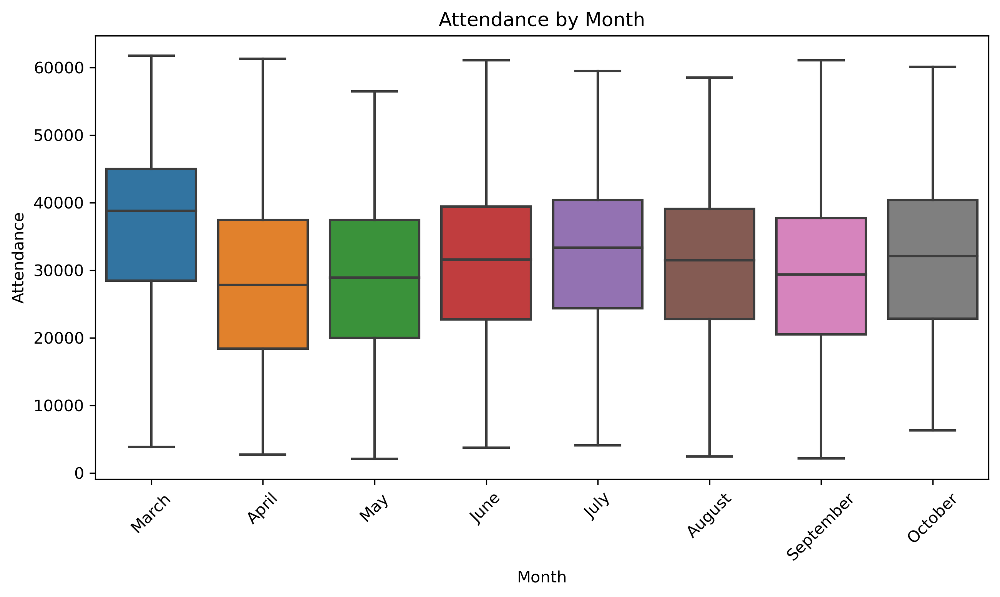
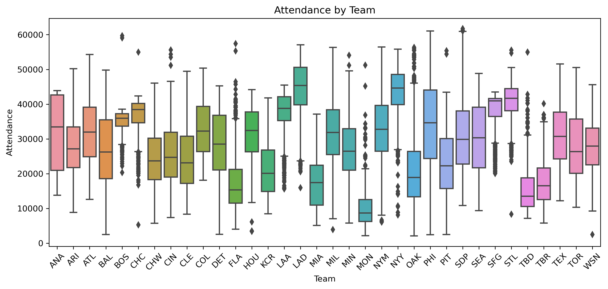
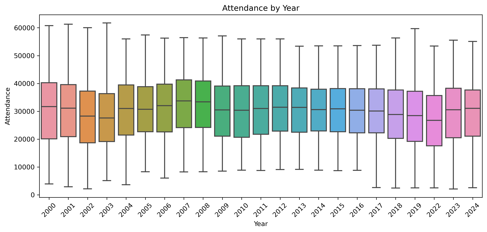
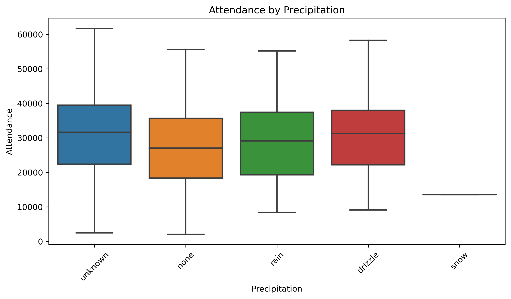
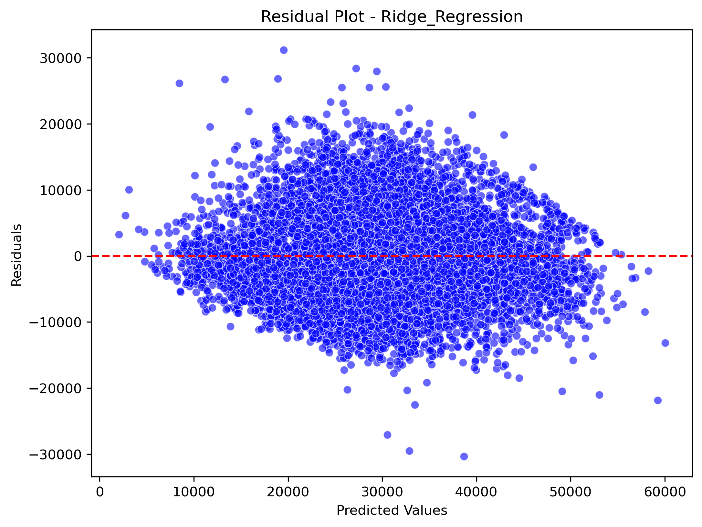
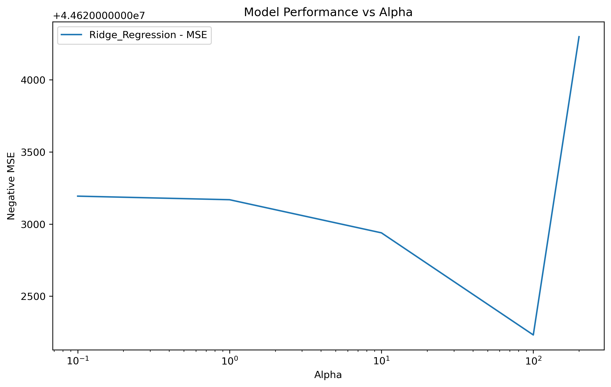
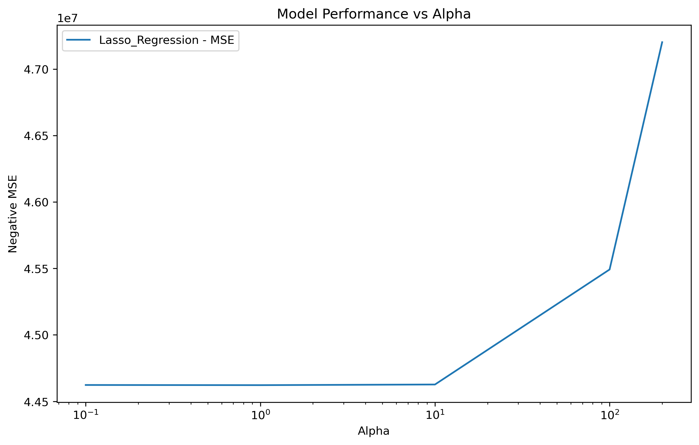

# CrowdCast
*Predicting MLB Attendance*

## Summary

CrowdCast is a machine learning model aimed at predicting attendance at Major League Baseball games. At this stage, CrowdCast leverages linear regression methods to model the collected data, establishing a baseline for modeling the relationship between game and non-game related factors and MLB attendance.

My presentation video can be found here: 

## Webscraping

The process of creating CrowdCast began with scraping data from [Baseball Reference](https://www.baseball-reference.com/). I developed a webscraping script to gather data from all MLB games from 2000-2024, opting to exclude the 2020 and 2021 seasons due to attendance restrictions from COVID. From each team's yearly schedule and results pages, I gathered data on every game played each year, including variables like the team's record and division rank on a given day, the number of runs they scored and allowed, the games' championship leverage indices, and many more. The script also included on-the-fly feature engineering, with new predictors created based on game data including rolling averages of runs scored and allowed over the course of a season, averages of runs scored and allowed in a team's last 10 games played, and a team's winning percentage in the last 10 games played.

## Data Processing

Additional data on weather conditions and stadium capacities was collected from other sources. [Retrosheet](https://www.retrosheet.org) has game data CSVs of its own including weather data from each game, and [Seamheads](https://www.seamheads.com/ballparks/) has yearly capacities for every MLB stadium. Data from these sources were filtered and merged with the scraped Baseball Reference data to create a single complete dataset.

This dataset was then cleaned, with type conversions performed and new features extracted. Daily records were used to create winning percentages, missing values (weather data, cLI) were filled through historical records and other means, certain features were encoded (night_game, streak, makeup), and unnecessary columns were dropped.

## Data Visualization

To get some preliminary visualizations of the data, I created several regression plots and boxplots showing the relationships between some of the features and attendance. Below is a plot showing the relationship between winning percentage and attendance. It is difficult to see a strong relationship in this case, but there does appear to be some degree of correlation: 

Below are a few boxplots showing some much more interesting relationships, some expected and some unexpected. First we have a plot of attendance by month, where we can see high attendance in March likely due to opening day, with attendance slowly increasing into the summer months and spiking in October with the end of the regular season: 

Next we have attendance by team, where we can clearly see some teams, like the Yankees and the Dodgers, outperforming others, like the Rays and the Marlins, in terms of attendance: 

Here we can see how attendance has trended over the years: 

Finally, we see a very odd relationship between attendance and precipitation. Unfortunately, a large percentage of collected games include no description of the precipitation, and it is not necessarily safe to assume that means there was none during those games, so much of this data is unknown. However, oddly enough, in the games for which we do have the data, games with rain or a drizzle seem to have higher attendance than those with no precipitation: 

These are just some preliminary ways of visualizing this data. t-SNE was briefly attempted in order to give a 3D representation of the data, but more work is required.

## Linear Modeling

Linear regression is used as a preliminary method for modeling the data. In addition to ordinary least squares, regularized regression is used in the form of Ridge and Lasso regression.

For these linear regression models, the stadium column is left out of the model (as this seemed to improve performance), as well as other redundant columns including weekday name and date. The numerical day of the week and month are both cyclically encoded with sine and cosine transformations to improve model performance. One-hot encoding is used on the precipitation, sky description, team, and opponent columns as this seemed to outperform label encoding. Additionally, numerical features are standardized.

An 80/20 train-test split is used for these models, and GridSearchCV is used to tune the alpha values for Ridge and Lasso. MAE, MSE, RMSE, and $$R^2$$ are all calculated to evaluate the models' performances.

## Results

Linear regression, Ridge, and Lasso each yield $$R^2$$ values of 0.62 on the training set and 0.63 on the testing set. Linear regression has a train MAE of 5293.55 and a test MAE of 5289.68. Ridge regression yields a train MAE of 5294.88 and a test MAE of 5291.06. Lasso results in a train MAE of 5294.14 and a test MAE of 5290.12. Below are the residual plots for each of the models, as well as plots showing the hyperparameter tuning for Ridge and Lasso:       

As we can see, regularization did not really improve the model here, and these $$R^2$$ values are moderate. The MAEs are fairly large on the scale of attendance as well. However, these models are only meant to be a baseline, and at the outset of this project I knew tree-based methods would likely be much better for this prediction task.

## Reporoducability

To reproduce these results, run:
 - `pip install -r requirements.txt`
 - `python models/linear_regression.py`
