# CrowdCast
*Predicting MLB Attendance*

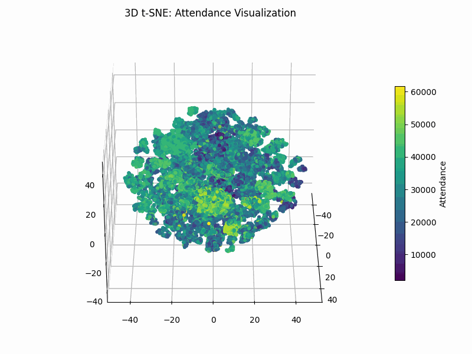

## Summary

CrowdCast is a machine learning model aimed at predicting attendance at Major League Baseball games. CrowdCast leverages XGBoost to model the complex relationship between schedule, performance, and weather factors and attendance. CrowdCast demonstrates strong performance, achieving impressive results despite the inherent variability and noise that comes with game attendance.

My presentation video can be found here: [https://www.youtube.com/watch?v=DQjQBMwV0cA](https://youtu.be/Sy_gXpp_ib0)

## Reproducibility

To reproduce my results and train a CrowdCast model, be sure to have the `game_data.csv`, `retrosheet_gameinfo_2000-2024.csv`, and `stadium_capacity_2000-2024.csv` files in the data directory, and then run:
 - `make install` to create a virtual environment and install dependencies
 - `make preprocess` to preprocess the data (merging datasets, engineering features, and cleaning the data)
 - `make visualize` to generate various plots visualizing the data (all can also be found in the [plots](plots/) directory)
 - `make train` to train and evaluate a model (including plots of model results)

`make clean` can be used to delete the virtual environment, and `make reinstall` can be used to recreate the environment and reinstall dependencies if needed.

## Webscraping

The process of creating CrowdCast began with scraping data from [Baseball Reference](https://www.baseball-reference.com/). I developed a webscraping script to gather data from all MLB games from 2000-2024, opting to exclude the 2020 and 2021 seasons due to attendance restrictions from COVID. From each team's yearly schedule and results pages, I gathered data on every game played each year, including variables like the team's record and division rank on a given day, the number of runs they scored and allowed, the games' championship leverage indices, and many more. The script also included on-the-fly feature engineering, with new predictors created based on game data, including rolling averages of runs scored and allowed over the course of a season, averages of runs scored and allowed in a team's last 10 games played, and a team's winning percentage in the last 10 games played.

## Data Processing

Additional data on weather conditions and stadium capacities were collected from other sources. [Retrosheet](https://www.retrosheet.org) has game data CSVs of its own including weather data from each game, and [Seamheads](https://www.seamheads.com/ballparks/) has yearly capacities for every MLB stadium. Data from these sources were filtered and merged with the scraped Baseball Reference data to create a single complete dataset.

This dataset was then cleaned, with type conversions performed and new features extracted. Daily records were used to create winning percentages, missing values (weather data, cLI) were filled through historical records and other means, certain features were encoded (night_game, streak, makeup), and unnecessary columns were dropped.

## Data Visualization

To get some preliminary visualizations of the data, I created several regression plots and boxplots showing the relationships between some of the features and attendance. Below is a plot showing the relationship between winning percentage and attendance. It is difficult to see a strong relationship in this case, but there does appear to be some degree of correlation: 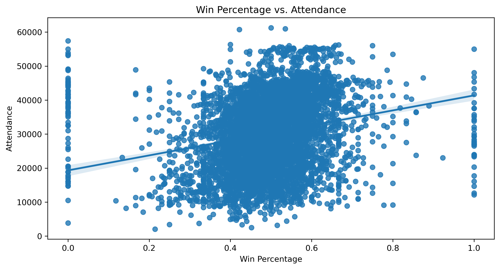

Below are a few boxplots showing some much more interesting relationships, some expected and some unexpected. First we have a plot of attendance by month, where we can see high attendance in March, likely due to opening day, with attendance slowly increasing into the summer months and spiking in October with the end of the regular season: 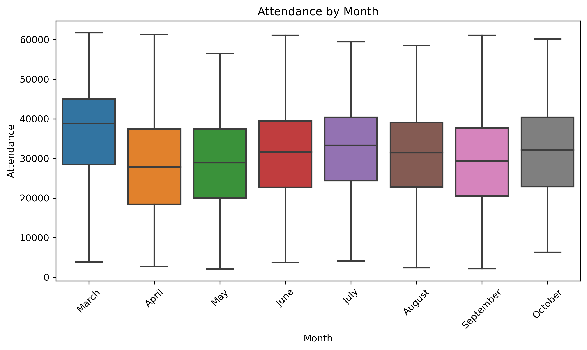

Next we have attendance by team, where we can clearly see some teams, like the Yankees and the Dodgers, outperforming others, like the Rays and the Marlins, in terms of attendance: 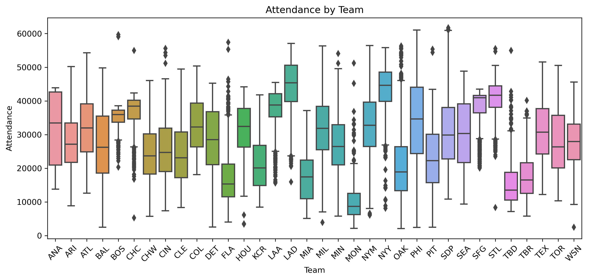

Here we can see how attendance has trended over the years: 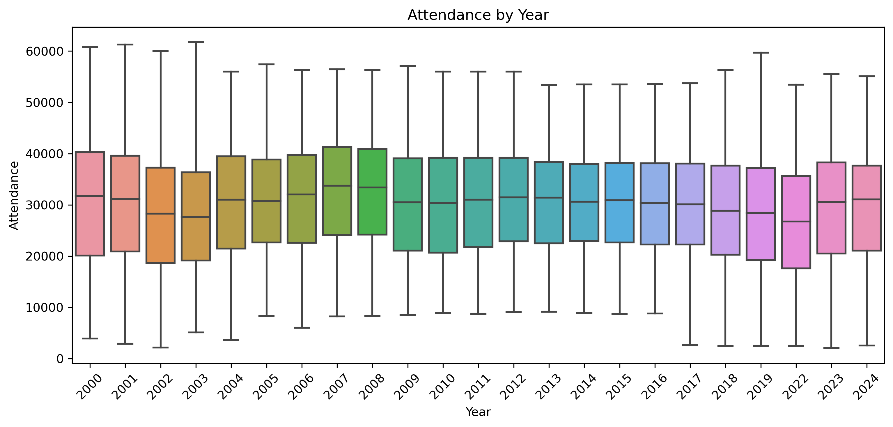

This plot shows a very odd relationship between attendance and precipitation. Unfortunately, a large percentage of collected games include no description of the precipitation, and it is not necessarily safe to assume that means there was none during those games, so much of this data is unknown. However, oddly enough, in the games for which we do have the data, games with rain or a drizzle seem to have higher attendance than those with no precipitation: 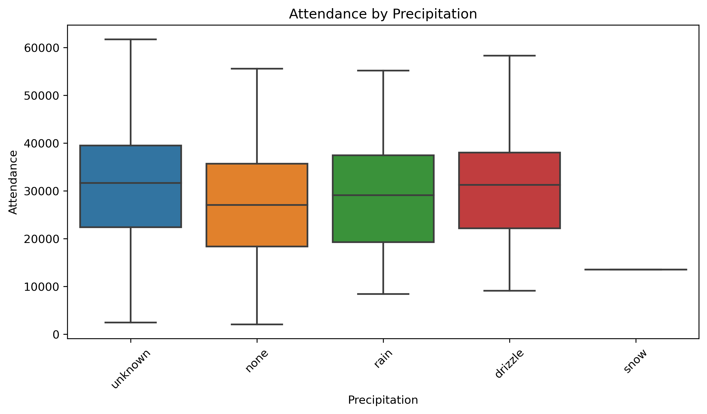

Finally, this 3D t-SNE visualization provides a comprehensive view of the dataset, offering insight into the underlying structure and clustering of attendance data. The plot captures the high-dimensional relationships between data points and projects them into a three-dimensional space, facilitating a better understanding of the distribution and patterns within the attendance data. The 3D space reveals distinct clusters of high and low attendance games, highlighting potential patterns and separations within the data that CrowdCast will leverage for learning. An interactive version of this plot is available in the [plots](plots/) directory (and can be generated following the commands specified above).

More plots of the data can be found in the [plots](plots/) directory.

## Baseline Models

In progressing towards a final model architecture, linear regression, ridge regression, lasso regression, random forests, and LightGBM were all attempted before settling on XGBoost. 

For all models, the data was first passed through a preprocessing pipeline where categorical variables like team, opponent, precipitation, and sky description were encoded and numerical features were standardized. For the linear models, day of the week and month were both cyclically encoded with sine and cosine transformations and the stadium column was removed to improve model performance (oddly enough the stadium column hurt model performance here but was among the strongest predictors in the tree-based models). For the tree-based methods, the team, opponent, and stadium features were label encoded, while they were one-hot encoded for the linear models. The precipitation and sky description features were one-hot encoded for all models. The numerical columns were also left as is, without standardization, for the tree-based methods, which are scale-insensitive. The weekday name and date columns were left out of all models since their information is captured by other features.

Linear regression yielded somewhat underwhelming results, with a test set $$R^2$$ of 0.63 and a mean absolute error of 5,289.68. Regularization did not help, as ridge and lasso produced near identical results. The logical next step was to move to more powerful tree-based ensemble methods. Random forests were fit next and produced an $$R^2$$ of 0.76, MAE of 3,993.88, and RMSE of 5,307.72 on the test set, a notable improvement over the linear models. With that, it was clear boosting methods would be the best bet. LightGBM produced a test $$R^2$$ of 0.84, an MAE of 3,218.98, and an RMSE of 2,779.18, but it came with pretty substantial overfitting. This all ultimately led to the final XGBoost model.

## XGBoost

XGBoost proved to be the most effective model for predicting attendance, and was thus selected as the final CrowdCast model. Its superior performance can be attributed to its ability to capture non-linear relationships and account for complex variable interactions in the data. By leveraging gradient boosting and regularization techniques, XGBoost is able to improve prediction accuracy while reducing overfitting, making it the ideal choice.

### Model Tuning

Tuning the XGBoost model proved to be a rather complicated task. I utilized GridSearchCV to find optimal hyperparameters, but ultimately the job was not as simple as simply picking the parameters that led to the best test set performance. Overfitting was a major obstacle, as certain sets of parameters led to the highest test performance but also resulted in substantial overfitting. Although high test performance initially seems promising, overfitting is a significant issue as it signals that the model may not always generalize so well to unseen data. While the model may perform well on my test set, it may not maintain that level of performance on new data, which could undermine its reliability and reduce its ability to make accurate predictions in a potential production environment. Thus, my aim was to find hyperparameters that would combat overfitting, at the very least reducing it to a more reasonable level, while still maintaining strong test performance.

The `max_depth` parameter was ultimately the key to all of this. A `max_depth` of 10 (combined with other parameters) yielded the absolute best test performance, but it resulted in substantial overfitting, with $$R^2$$ values around 0.96-0.97 on the training data. Deeper trees have much more flexibility and can follow noise in the training data, resulting in high training performance but much lower test performance. In this case, while test performance didn't suffer too much, the concern highlighted above remained.

Ultimately, the tradeoff was to sacrifice some of that flexibility by lowering the `max_depth` to 7, in combination with other regularization and complexity-controlling parameters, to reduce overfitting. The parameters that resulted in the best overall performance, while keeping overfitting in check, were as follows: 
 - `max_depth = 7`
 - `n_estimators = 300`
 - `learning_rate = 0.1`
 - `gamma = 0`
 - `min_child_weight = 15`
 - `reg_alpha = 1`
 - `reg_lambda = 5`

These are the parameters utilized by CrowdCast.

### Results

To evaluate the model, I used an 80/20 train/test split. The training set was further split into 80% training and 20% validation, ensuring that the model could be evaluated on both a validation set (to tune hyperparameters) and an unseen test set.

CrowdCast ultimately achieved an impressive $$R^2$$ of 0.83 on the test data. In further testing, 5-fold cross-validation resulted in a mean $$R^2$$ of 0.83 with a standard deviation of 0.00 across folds, indicating stable performance and underscoring the model's robustness and reliability. On the test set, the model also achieved an MAE of 3,371.51 and an RMSE of 4,463.27. There was still a bit of overfitting, as the training set $$R^2$$ was 0.90,  but this was not substantial enough to outweigh the model's high performance on the test data, making it a worthwhile tradeoff.

I had hoped to gather data from the first month of the 2025 season to further test the model, but since the data comes from multiple sources which are not all up-to-date, this would have been very difficult and would have required complicated tweaks to my webscraping script, so I leave this as future work.

Below are some plots that reflect CrowdCast's performance. Here we can see the residual plot, a plot of the actual versus predicted attendance, and the distribution of prediction errors:
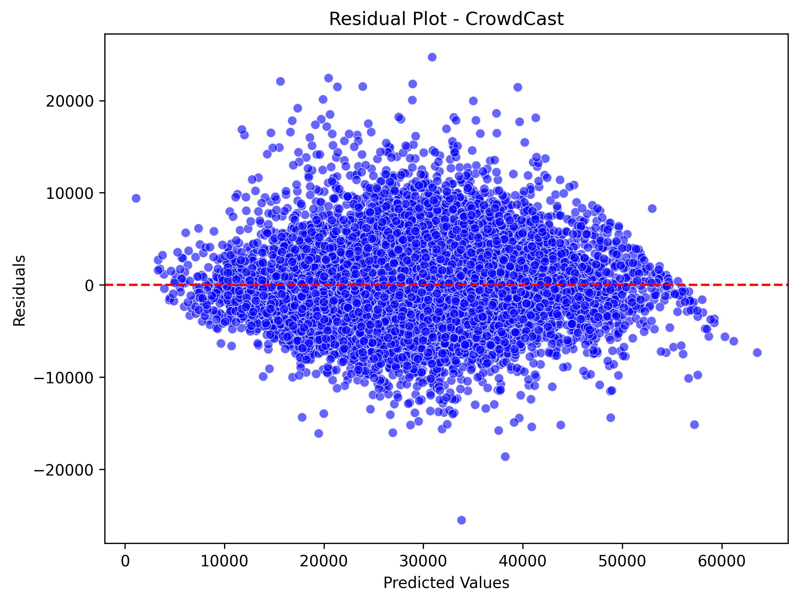 
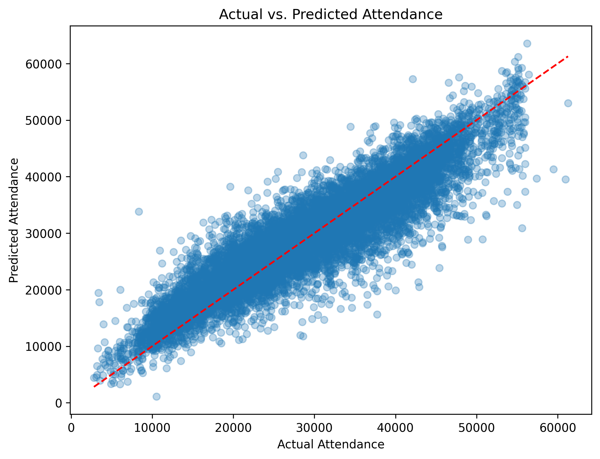
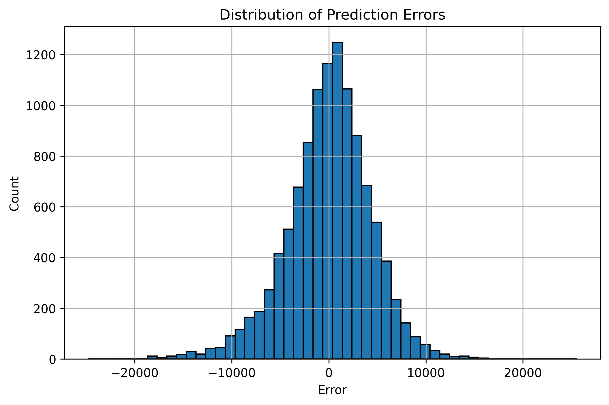

Here we can get a sense of the most important predictors of attendance and how they affect the model:
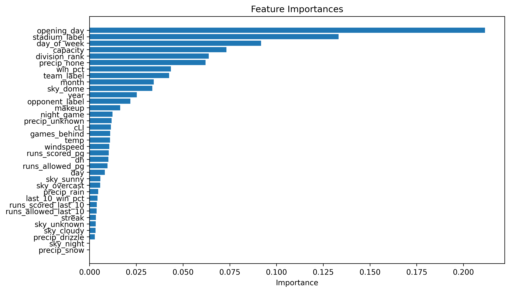
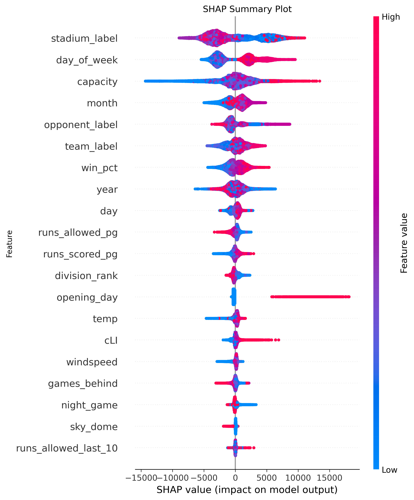

Interestingly, most of the weather factors are not particularly strong predictors, though I suspect this is due to this being the most incomplete component of the data. Whether or not the game is on opening day being the strongest predictor is fairly surprising as well. Unsurprisingly, general team performance factors like division rank and winning percentage have high importance, as well general information like the team and stadium. It seems, however, that recent team performance is not so important, as all of the last_10 columns have low importance. 

All of this goes to show how difficult it truly is to fully understand and predict attendance in professional sports. Many factors influence a person's decision to attend a game, from making plans well in advance to deciding at the last minute, making it challenging to account for the full range of behaviors. Weather plays an unpredictable role, with sudden changes affecting turnout. Certain teams have a stronger fanbase, naturally drawing larger crowds. These complexities make it clear that attendance is influenced by a variety of dynamic, often unpredictable factors, underscoring the challenge of building a model that can accurately capture and predict such a nuanced phenomenon. Given the complexity and unpredictability of these factors, CrowdCast's ability to achieve strong predictive performance is particularly impressive, demonstrating its robustness in capturing the intricacies of attendance behavior.
